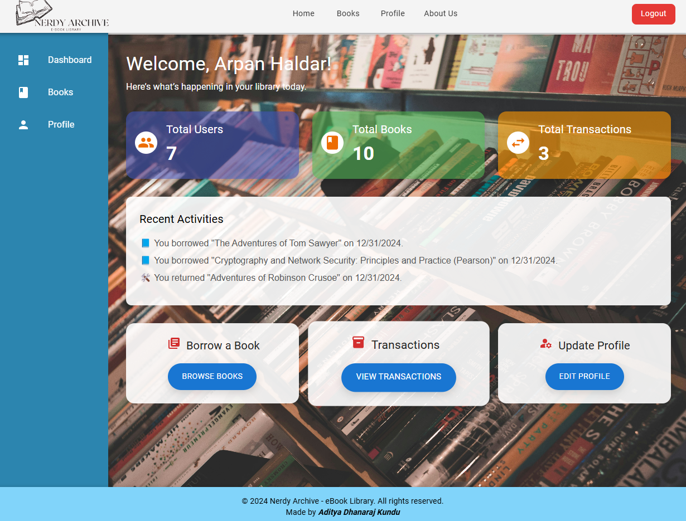
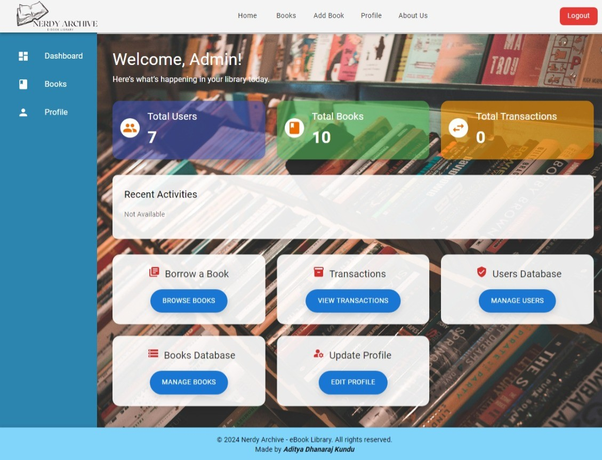
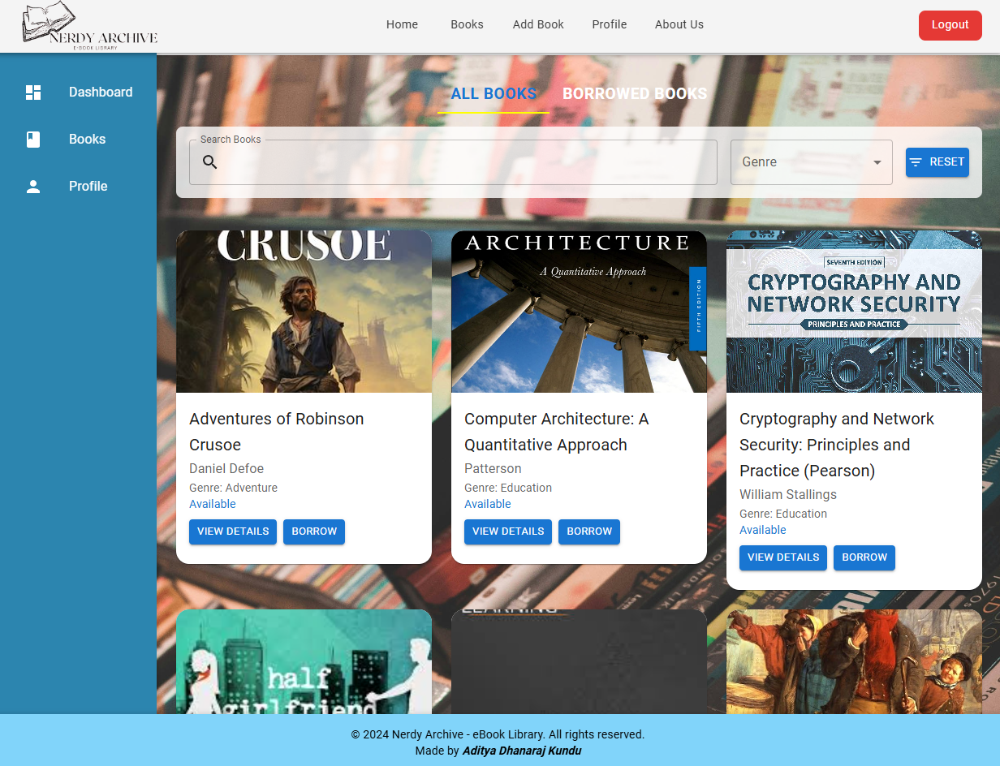
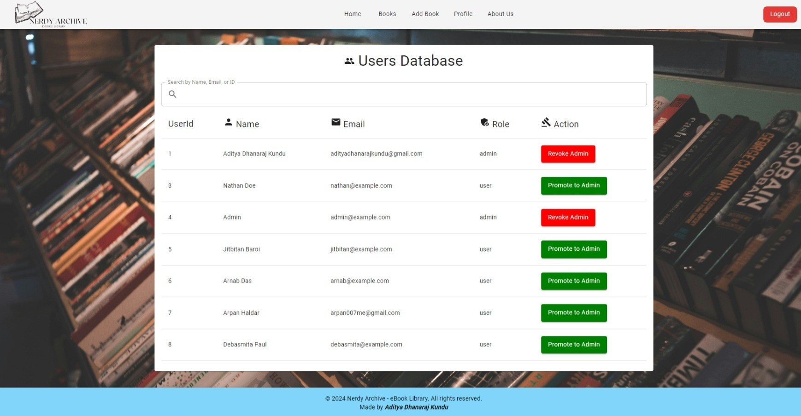
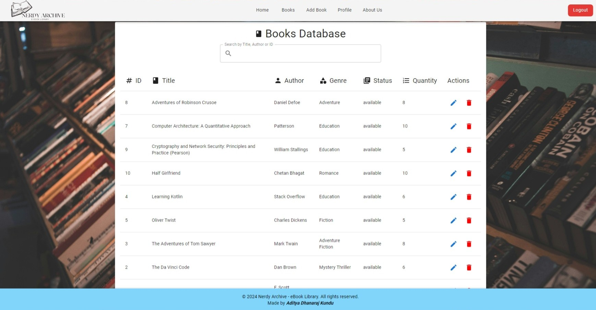

# Nerdy Archive - Digital E-Books Archive with Library Management System

## Table of Contents
- [Overview](#overview)
- [Features](#features)
- [Key Functionalities](#key-functionalities)
- [Technologies Used](#technologies-used)
- [Dependencies](#dependencies)
- [Folder Structure](#folder-structure)
- [Handling Offline and eBook Borrowing](#handling-offline-and-ebook-borrowing)
- [Application Screenshots](#application-screenshots)
- [Future Enhancements](#future-enhancements)
- [Contribution](#contributions)

## Overview
Nerdy Archive (LMS) is a comprehensive solution for managing both offline/physical book borrowing and digital eBook lending in libraries. The system facilitates user authentication, book transactions, and administrative control over library resources.

---

## Features
- **User Management :**
  - JWT-based secure login and registration.
  - Forgot password and reset password functionality.
- **Book Management :**
  - Separate handling for physical book borrowing and eBook lending.
  - eBooks are managed as PDF files, and physical books are tracked with transaction records.
- **Transaction Management :**
  - Borrow and return books with due date tracking.
  - Fine calculation for late return of books.
  - Ensures availability and manages borrowing limits.
- **Reset Password :**
  - Secure password reset via email with token-based validation.
- **Offline and eBook Handling**:
  - Separate workflows for borrowing physical books and downloading eBooks. 

## Key Functionalities

### User Authentication
- Secure registration and login.
- Token-based authentication using JWT.

### Book Management
- Add, update, and delete books.
- Manage physical book inventory and eBook PDFs separately.

### User Management
- Users can view their profiles, update their information, and reset passwords.
- Admins can manage users, including updating roles and deleting accounts.

### Transaction Management
- Admins can add, edit, and delete books.
- Users can search for books and view availability.
- Download eBooks directly from the system.
- Transactions are updated automatically when books are issued or returned.

### Password Reset
- Users can reset their password via email.
- Implements secure token-based reset mechanism.

---

## Handling Offline and eBook Borrowing
This LMS includes provisions to handle both **offline/physical book borrowing** and **eBook lending**:

- **Offline Book Borrowing**:
  - Tracks the number of available physical copies.
  - Borrowers can check out books and must return them before the due date.
  - Due dates and fines (if applicable) are managed through the system.

- **eBook Lending**:
  - Users can download eBook PDFs directly from the system.
  - eBook availability is not restricted by inventory, ensuring unlimited downloads.
  - eBook files are stored securely in the `uploads/` directory of the `backend/` or `server/` folder.

---

## Technologies Used
- **Backend**: Node.js, Express.js
- **Database**: MySQL (Aiven MySQL by DigitalOcean)
- **ORM**: Sequelize
- **Frontend**: React.js (with Material-UI for styling), Vite template
- **Email Service**: Nodemailer
- **Deployment**: Backend in Virtual Machine by any Cloud Provider (AWS, Azure, Google Cloud), Frontend in Vercel or Heroku

---

## Dependencies

### Backend Dependencies
- **`bcrypt`** (^5.1.1): Used for password hashing to securely store user credentials.  
- **`body-parser`** (^1.20.3): Parses incoming request bodies for API handling.  
- **`cors`** (^2.8.5): Enables Cross-Origin Resource Sharing, allowing requests from different origins.  
- **`crypto`** (^1.0.1): Provides cryptographic functions for secure token handling.  
- **`dotenv`** (^16.4.7): Loads environment variables from a `.env` file into the application.  
- **`express`** (^4.21.2): A web framework for building the backend server.  
- **`jsonwebtoken`** (^9.0.2): Implements JSON Web Tokens (JWT) for user authentication.  
- **`multer`** (^1.4.5): Handles file uploads, particularly for eBooks in PDF format.  
- **`mysql2`** (^3.11.5): MySQL client used for database connections and queries.  
- **`nodemailer`** (^6.9.16): Sends emails for password resets and other notifications.  
- **`sequelize`** (^6.37.5): ORM for managing database models and handling queries.  
- **`sequelize-cli`** (^6.6.2): Command-line tool for Sequelize migrations and model management.

### Frontend Dependencies
- **`@emotion/react`** (^11.14.0): CSS-in-JS library for styling React components.  
- **`@emotion/styled`** (^11.14.0): Provides styled-components support using Emotion.  
- **`@mui/material`** (^6.2.0): Material-UI components for building a responsive and consistent UI.  
- **`axios`** (^1.7.9): HTTP client for making API requests to the backend.  
- **`react`** (^18.3.1): Core library for building user interfaces.  
- **`react-dom`** (^18.3.1): DOM-specific methods for rendering React components.  
- **`react-router-dom`** (^6.28.0): Routing library for navigating between pages.  
- **`formik`** (^2.4.6): Simplifies form state management and validation.  
- **`yup`** (^1.5.0): Schema validation library, often used with Formik for form validation.  
- **`react-icons`** (^5.4.0): Icon library to easily add scalable vector icons to the UI.  
- **`@react-pdf-viewer/core`** (^3.12.0): Library for rendering PDF files within React applications.  
- **`@react-pdf-viewer/default-layout`** (^3.12.0): Adds layout and navigation features to the PDF viewer.

## Folder Structure
```
LibraryManagementSystem/
├── backend/
│   ├── certs/              # Contains SSL certificates (e.g., ca.pem)
│   ├── config/             # Configuration files (e.g., database connection)
│   ├── controllers/        # API controllers
│   ├── middleware/         # Middleware for users authentication, token verification, authorisation, and files verification
│   ├── models/             # Sequelize models
│   ├── routes/             # API routes
│   ├── uploads/            # File uploads (e.g., eBook PDFs)
│   └── utils/              # Utility functions (e.g., email handling)
├── frontend/
│   ├── public/             # Public assets
│   ├── src/                # React source files
│   │   ├── components/     # Reusable React components
│   │   ├── pages/          # Application pages (e.g., Dashboard, Profile)
│   │   ├── services/       # API service integrations
│   │   └── routes/         # frontend routes
|   |   |__ hooks/          # custom hooks
|   |__ app.jsx
|   |__ main.jsx
└── README.md               # Project documentation
```

## Environment Variables
Create a `.env` file in the `backend` folder with the following:
```env
PORT=<port_number>
DB_HOST=<local or cloud MySQL host instance url>
DB_PORT=<Database_port_number>
DB_USER=<database_user_name>
DB_PASSWORD=<database_password>
DB_NAME=defaultdb
JWT_SECRET=your_jwt_secret
EMAIL_USER=your_email@example.com
EMAIL_PASSWORD=your_email_password
FRONTEND_URL=http://localhost:5173
```

## Application Screenshots

#### Home Page


#### Dashboard Page
User Dashboard
 <br />
Admin Dashboard
 

#### Books List


#### Books Details


#### Manage Users Page


#### Manage Books Page


#### Reset Password Page


## Future Enhancements
- Add real-time notifications for due dates and reminders.

---
This README provides an in-depth overview of the Library Management System, highlighting its ability to manage both physical books and eBooks effectively. It also ensures a seamless user experience for both administrators and borrowers.

### Contribution

We welcome contributions to improve the Library Management System! Here's how you can contribute:

1. **Fork the repository**: Create a personal fork of the repository on GitHub.
2. **Clone your fork**: Clone your fork to your local machine and create a new branch for your changes.
3. **Make your changes**: Implement your improvements or fixes, and ensure that your code works as expected.
4. **Commit your changes**: Write clear commit messages explaining your changes.
5. **Push to your fork**: Push your changes to your forked repository on GitHub.
6. **Create a Pull Request**: Open a Pull Request (PR) to the main repository with a description of your changes.

Please make sure to follow the project's coding conventions, write tests for new features, and update documentation as needed.

We appreciate all contributions, big or small!
